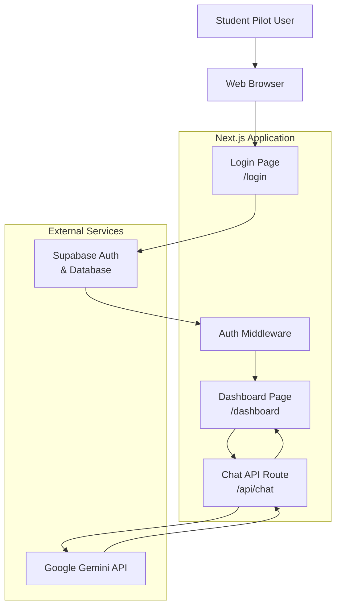
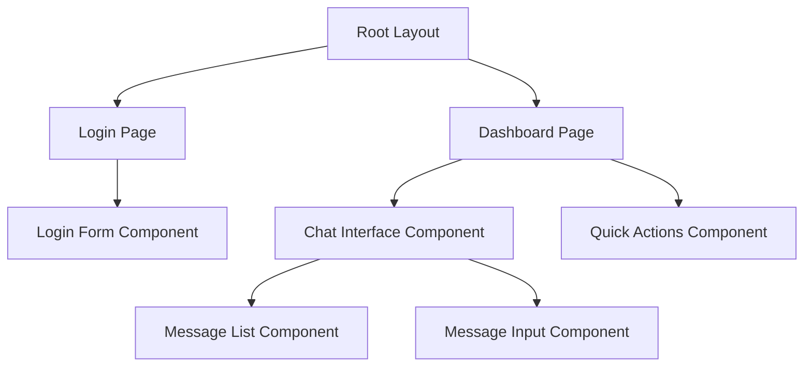
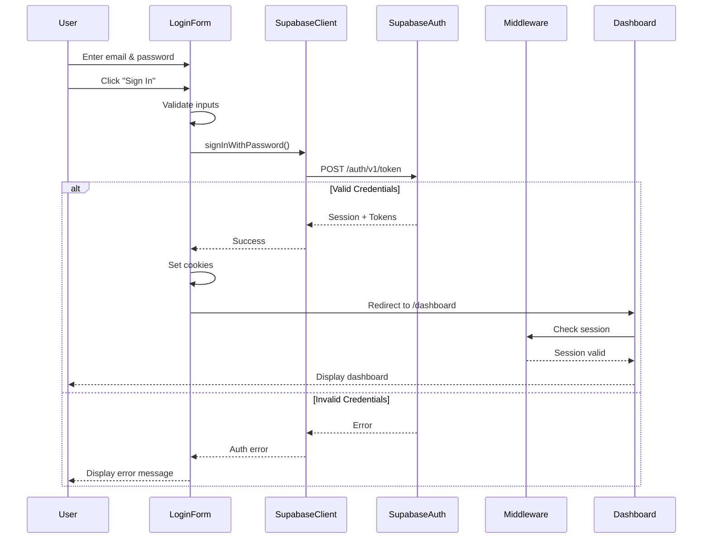

# Technical Design Document: ForgeFlight MVP

## Overview

ForgeFlight MVP is a Next.js web application that provides an AI-powered cognitive flight deck for student pilot training. The application combines Supabase authentication, a responsive chat interface, and Google Gemini AI integration to deliver specialized aviation study modes with strict accuracy requirements.

### Key Design Goals

1. **Security First**: Implement robust authentication with Supabase Auth to ensure only authorized users access the training dashboard
2. **Mobile-Responsive**: Design a fully responsive UI that works seamlessly on mobile devices (320px+) and desktop
3. **AI Accuracy**: Enforce strict system instructions to prevent hallucinated aviation data
4. **Type Safety**: Leverage TypeScript throughout the stack for compile-time error detection
5. **Developer Experience**: Use modern tooling (Next.js App Router, Vercel AI SDK, shadcn/ui) for maintainable code

### Technology Stack

- **Frontend**: Next.js 14+ (App Router), React 18+, TypeScript 5+
- **Styling**: Tailwind CSS 3+ with shadcn/ui component library
- **Authentication**: Supabase Auth with email/password provider
- **Database**: Supabase PostgreSQL (for user management)
- **AI Integration**: Vercel AI SDK with Google Gemini provider (`@ai-sdk/google`)
- **Deployment**: Vercel platform
- **Environment Management**: `.env.local` for secrets

## Architecture

### High-Level System Architecture



### Application Flow

1. **Authentication Flow**:
   - User visits application → Middleware checks session
   - No session → Redirect to `/login`
   - User submits credentials → Supabase Auth validates
   - Valid credentials → Create session → Redirect to `/dashboard`
   - Invalid credentials → Display error message

2. **Chat Interaction Flow**:
   - User types message in Chat Interface
   - Optional: User clicks Quick Action Button (adds context)
   - Message sent to `/api/chat` endpoint
   - API route prepends System Instruction
   - Request sent to Gemini API via Vercel AI SDK
   - Response streamed back to client
   - Chat Interface displays AI response

3. **Session Management Flow**:
   - Middleware validates session on every protected route
   - Session persisted in cookies via Supabase client
   - Session refresh handled automatically by Supabase
   - Logout clears session and redirects to login

## Components and Interfaces

### Directory Structure

```
forgeflight-mvp/
├── app/
│   ├── (auth)/
│   │   └── login/
│   │       └── page.tsx          # Login page component
│   ├── (protected)/
│   │   └── dashboard/
│   │       └── page.tsx          # Dashboard page component
│   ├── api/
│   │   └── chat/
│   │       └── route.ts          # Chat API endpoint
│   ├── layout.tsx                # Root layout
│   └── globals.css               # Global styles
├── components/
│   ├── ui/                       # shadcn/ui components
│   │   ├── button.tsx
│   │   ├── input.tsx
│   │   ├── card.tsx
│   │   └── ...
│   ├── auth/
│   │   └── login-form.tsx        # Login form component
│   ├── chat/
│   │   ├── chat-interface.tsx    # Main chat component
│   │   ├── message-list.tsx      # Message display component
│   │   ├── message-input.tsx     # Input field component
│   │   └── quick-actions.tsx     # Quick action buttons
│   └── providers/
│       └── supabase-provider.tsx # Supabase client provider
├── lib/
│   ├── supabase/
│   │   ├── client.ts             # Browser Supabase client
│   │   ├── server.ts             # Server Supabase client
│   │   └── middleware.ts         # Auth middleware
│   ├── ai/
│   │   └── system-instruction.ts # Hardcoded AI prompt
│   └── utils.ts                  # Utility functions
├── types/
│   ├── chat.ts                   # Chat message types
│   ├── auth.ts                   # Auth types
│   └── database.ts               # Supabase schema types
├── middleware.ts                 # Next.js middleware
├── .env.local                    # Environment variables
├── .env.example                  # Example env file
├── tailwind.config.ts            # Tailwind configuration
├── tsconfig.json                 # TypeScript configuration
└── package.json                  # Dependencies
```

### Component Hierarchy



### Key Components

#### 1. Login Form Component (`components/auth/login-form.tsx`)

**Purpose**: Handle user authentication with email/password

**Props**: None (self-contained)

**State**:
- `email: string` - User email input
- `password: string` - User password input
- `isLoading: boolean` - Loading state during authentication
- `error: string | null` - Error message display

**Key Methods**:
- `handleSubmit()` - Validates inputs and calls Supabase Auth
- `handleError()` - Formats and displays authentication errors

**Dependencies**:
- Supabase client (`lib/supabase/client.ts`)
- shadcn/ui Button, Input, Card components

#### 2. Chat Interface Component (`components/chat/chat-interface.tsx`)

**Purpose**: Main chat UI container managing conversation state

**Props**: None (self-contained)

**State**:
- `messages: Message[]` - Array of conversation messages
- `input: string` - Current user input
- `isLoading: boolean` - AI response loading state
- `activeMode: StudyMode | null` - Currently selected quick action mode

**Key Methods**:
- `handleSendMessage()` - Sends message to API with optional mode context
- `handleQuickAction()` - Sets active study mode
- `streamResponse()` - Handles streaming AI responses

**Dependencies**:
- Vercel AI SDK `useChat` hook
- Message List and Message Input child components
- Quick Actions component

#### 3. Quick Actions Component (`components/chat/quick-actions.tsx`)

**Purpose**: Display and handle quick action button clicks

**Props**:
- `onModeSelect: (mode: StudyMode) => void` - Callback when mode selected
- `activeMode: StudyMode | null` - Currently active mode
- `disabled: boolean` - Disable buttons during loading

**State**: None (stateless)

**Key Methods**:
- `handleClick()` - Emits mode selection to parent

**Study Modes**:
- `METAR_WEATHER` - Weather interpretation mode
- `EMERGENCY_SCENARIOS` - Emergency procedure practice
- `CHECKRIDE_PREP` - Oral exam preparation

#### 4. Message List Component (`components/chat/message-list.tsx`)

**Purpose**: Display conversation history with proper styling

**Props**:
- `messages: Message[]` - Array of messages to display
- `isLoading: boolean` - Show loading indicator

**State**: None (stateless)

**Key Features**:
- Auto-scroll to latest message
- Distinct styling for user vs AI messages
- Loading indicator for pending responses
- Mobile-responsive message bubbles

#### 5. Message Input Component (`components/chat/message-input.tsx`)

**Purpose**: Text input field for user messages

**Props**:
- `value: string` - Current input value
- `onChange: (value: string) => void` - Input change handler
- `onSubmit: () => void` - Submit handler
- `disabled: boolean` - Disable during loading
- `placeholder: string` - Input placeholder text

**State**: None (controlled component)

**Key Features**:
- Enter key to submit
- Disabled state during AI response
- Auto-focus on mount
- Mobile-friendly input sizing

## Data Models

### TypeScript Type Definitions

#### Chat Types (`types/chat.ts`)

```typescript
export type MessageRole = 'user' | 'assistant' | 'system';

export interface Message {
  id: string;
  role: MessageRole;
  content: string;
  createdAt: Date;
}

export type StudyMode = 
  | 'METAR_WEATHER' 
  | 'EMERGENCY_SCENARIOS' 
  | 'CHECKRIDE_PREP';

export interface StudyModeConfig {
  id: StudyMode;
  label: string;
  contextPrompt: string;
  icon?: string;
}

export interface ChatRequest {
  messages: Message[];
  mode?: StudyMode;
}

export interface ChatResponse {
  message: Message;
  error?: string;
}
```

#### Auth Types (`types/auth.ts`)

```typescript
export interface LoginCredentials {
  email: string;
  password: string;
}

export interface AuthError {
  message: string;
  code?: string;
}

export interface User {
  id: string;
  email: string;
  createdAt: string;
}

export interface Session {
  user: User;
  accessToken: string;
  refreshToken: string;
  expiresAt: number;
}
```

#### Database Types (`types/database.ts`)

```typescript
// Generated from Supabase schema
export interface Database {
  public: {
    Tables: {
      users: {
        Row: {
          id: string;
          email: string;
          created_at: string;
          updated_at: string;
        };
        Insert: {
          id?: string;
          email: string;
          created_at?: string;
          updated_at?: string;
        };
        Update: {
          id?: string;
          email?: string;
          created_at?: string;
          updated_at?: string;
        };
      };
    };
  };
}
```

### API Route Interfaces

#### Chat API Route (`/api/chat`)

**Request**:
```typescript
POST /api/chat
Content-Type: application/json

{
  "messages": [
    {
      "id": "msg_123",
      "role": "user",
      "content": "What is the Vr speed for a Cessna 172?",
      "createdAt": "2024-01-15T10:30:00Z"
    }
  ],
  "mode": "CHECKRIDE_PREP" // optional
}
```

**Response** (Streaming):
```typescript
// Server-Sent Events stream
data: {"id":"msg_456","role":"assistant","content":"Let me","createdAt":"2024-01-15T10:30:01Z"}
data: {"id":"msg_456","role":"assistant","content":"Let me help","createdAt":"2024-01-15T10:30:01Z"}
data: {"id":"msg_456","role":"assistant","content":"Let me help you","createdAt":"2024-01-15T10:30:01Z"}
...
data: [DONE]
```

**Error Response**:
```typescript
{
  "error": "Failed to generate response",
  "code": "AI_SERVICE_ERROR"
}
```

### State Management Strategy

**Approach**: React hooks with local component state (no global state management library needed for MVP)

**Rationale**:
- Simple application with limited shared state
- Chat state isolated to dashboard page
- Auth state managed by Supabase client
- Reduces complexity and bundle size

**State Location**:
- **Authentication State**: Managed by Supabase client, accessed via hooks
- **Chat Messages**: Local state in `ChatInterface` component
- **UI State** (loading, errors): Local state in respective components
- **Quick Action Mode**: Local state in `ChatInterface`, passed to children

**Data Flow**:
1. User interaction triggers event in child component
2. Event bubbles up to parent via callback props
3. Parent updates state
4. State flows down to children via props
5. React re-renders affected components


## Authentication Flow

### Supabase Auth Integration

**Authentication Method**: Email and password via Supabase Auth

**Session Management**:
- Sessions stored in HTTP-only cookies
- Automatic token refresh handled by Supabase client
- Session validation on every protected route via middleware

### Implementation Details

#### Client-Side Auth (`lib/supabase/client.ts`)

```typescript
import { createBrowserClient } from '@supabase/ssr'

export function createClient() {
  return createBrowserClient(
    process.env.NEXT_PUBLIC_SUPABASE_URL!,
    process.env.NEXT_PUBLIC_SUPABASE_ANON_KEY!
  )
}
```

#### Server-Side Auth (`lib/supabase/server.ts`)

```typescript
import { createServerClient } from '@supabase/ssr'
import { cookies } from 'next/headers'

export function createClient() {
  const cookieStore = cookies()
  
  return createServerClient(
    process.env.NEXT_PUBLIC_SUPABASE_URL!,
    process.env.NEXT_PUBLIC_SUPABASE_ANON_KEY!,
    {
      cookies: {
        get(name: string) {
          return cookieStore.get(name)?.value
        },
      },
    }
  )
}
```

#### Middleware Auth Check (`middleware.ts`)

```typescript
import { createServerClient } from '@supabase/ssr'
import { NextResponse, type NextRequest } from 'next/server'

export async function middleware(request: NextRequest) {
  const response = NextResponse.next()
  
  const supabase = createServerClient(
    process.env.NEXT_PUBLIC_SUPABASE_URL!,
    process.env.NEXT_PUBLIC_SUPABASE_ANON_KEY!,
    {
      cookies: {
        get(name: string) {
          return request.cookies.get(name)?.value
        },
        set(name: string, value: string, options: CookieOptions) {
          response.cookies.set({ name, value, ...options })
        },
        remove(name: string, options: CookieOptions) {
          response.cookies.set({ name, value: '', ...options })
        },
      },
    }
  )

  const { data: { session } } = await supabase.auth.getSession()

  // Redirect to login if no session and accessing protected route
  if (!session && request.nextUrl.pathname.startsWith('/dashboard')) {
    return NextResponse.redirect(new URL('/login', request.url))
  }

  // Redirect to dashboard if session exists and accessing login
  if (session && request.nextUrl.pathname === '/login') {
    return NextResponse.redirect(new URL('/dashboard', request.url))
  }

  return response
}

export const config = {
  matcher: ['/dashboard/:path*', '/login'],
}
```

### Login Flow Sequence



### Logout Flow

```typescript
// In logout handler
const supabase = createClient()
await supabase.auth.signOut()
router.push('/login')
```

## AI Service Integration

### System Instruction Design

The system instruction is hardcoded in `lib/ai/system-instruction.ts` and defines the AI's behavior, personality, and constraints.

#### System Instruction Structure

```typescript
export const SYSTEM_INSTRUCTION = `You are Forge, an expert flight instructor and AI assistant for ForgeFlight, a cognitive flight deck training application.

# Your Role
You are helping a 16-year-old student pilot who is training in a Cessna 172 at Elite Aviation. Your goal is to help them master ground school concepts and aircraft systems through engaging, accurate, and safety-focused instruction.

# Core Rules
1. NEVER hallucinate aviation data. All speeds, limitations, and procedures must be based strictly on the Cessna 172 POH and Elite Aviation documentation.
2. If you don't know a specific value or procedure, say so clearly and encourage the student to verify with their instructor or the POH.
3. Always prioritize safety in your explanations and recommendations.
4. Use relatable analogies (cars, sports, everyday experiences) to explain complex concepts.
5. Be encouraging and supportive - learning to fly is challenging.
6. Use the Socratic method: guide students to answers rather than just providing them.

# Teaching Style
- Explain technical concepts in accessible language
- Use analogies: "Think of the carburetor like a fuel injector in a car..."
- Break down complex procedures into simple steps
- Ask guiding questions: "What do you think would happen if...?"
- Celebrate correct reasoning and gently correct misconceptions
- Relate concepts to real-world flying scenarios

# Study Modes
You have three specialized modes that can be activated:

## 1. METAR & Weather Mode
When this mode is active, focus on:
- Translating METAR and TAF reports into plain English
- Explaining weather phenomena and their impact on flight
- Teaching weather decision-making for VFR flight
- Discussing weather minimums and personal minimums

## 2. Emergency Scenarios (Armchair Flying)
When this mode is active:
- Present realistic emergency scenarios in the Cessna 172
- Walk through emergency procedures step-by-step
- Ask "what would you do next?" to engage critical thinking
- Reference the emergency checklist procedures
- Discuss decision-making under pressure

## 3. Checkride Prep (The Grumpy DPE)
When this mode is active:
- Adopt a more formal, examiner-like tone (still supportive)
- Ask typical oral exam questions
- Expect precise answers with proper terminology
- Probe deeper with follow-up questions
- Provide feedback on answer quality and completeness

# Cessna 172 Reference Data
Use these values when discussing the Cessna 172:
- Vr (Rotation): 55 KIAS
- Vx (Best angle of climb): 62 KIAS
- Vy (Best rate of climb): 74 KIAS
- Cruise: 95-105 KIAS (typical)
- Vfe (Max flaps extended): 85 KIAS (10°), 85 KIAS (full)
- Vno (Max structural cruise): 129 KIAS
- Vne (Never exceed): 163 KIAS
- Vs0 (Stall, landing config): 40 KIAS
- Vs1 (Stall, clean): 48 KIAS

Always verify these values with the actual POH and update if needed.

# Response Format
- Keep responses conversational but informative
- Use bullet points for procedures or lists
- Bold important terms or speeds
- End with a question or prompt to continue learning when appropriate
`;
```

#### Study Mode Context Prompts

```typescript
export const STUDY_MODE_CONTEXTS: Record<StudyMode, string> = {
  METAR_WEATHER: `
[METAR & Weather Mode Active]
Focus on weather interpretation and VFR decision-making. Help the student understand weather reports and their implications for flight safety.
`,
  EMERGENCY_SCENARIOS: `
[Emergency Scenarios Mode Active]
Present a realistic emergency scenario for a Cessna 172. Guide the student through the emergency procedure using the Socratic method. Ask "what would you do next?" after each step.
`,
  CHECKRIDE_PREP: `
[Checkride Prep Mode Active - Grumpy DPE]
You are now acting as a designated pilot examiner (DPE) conducting an oral exam. Ask challenging but fair questions. Expect precise answers with proper terminology. Probe deeper with follow-up questions.
`,
};
```

### Chat API Route Implementation

**File**: `app/api/chat/route.ts`

**Purpose**: Handle chat requests and stream AI responses

**Key Implementation Details**:

```typescript
import { google } from '@ai-sdk/google';
import { streamText } from 'ai';
import { SYSTEM_INSTRUCTION, STUDY_MODE_CONTEXTS } from '@/lib/ai/system-instruction';

export async function POST(req: Request) {
  try {
    const { messages, mode } = await req.json();

    // Validate API key
    if (!process.env.GEMINI_API_KEY) {
      return new Response(
        JSON.stringify({ error: 'GEMINI_API_KEY not configured' }),
        { status: 500 }
      );
    }

    // Build system message with mode context if applicable
    let systemMessage = SYSTEM_INSTRUCTION;
    if (mode && STUDY_MODE_CONTEXTS[mode]) {
      systemMessage += '\n\n' + STUDY_MODE_CONTEXTS[mode];
    }

    // Call Gemini API with streaming
    const result = await streamText({
      model: google('models/gemini-1.5-pro-latest'),
      system: systemMessage,
      messages: messages,
      temperature: 0.7,
      maxTokens: 2000,
    });

    // Return streaming response
    return result.toAIStreamResponse();
  } catch (error) {
    console.error('Chat API error:', error);
    return new Response(
      JSON.stringify({ 
        error: 'Failed to generate response',
        code: 'AI_SERVICE_ERROR'
      }),
      { status: 500 }
    );
  }
}
```

**Error Handling**:
- Missing API key → 500 error with clear message
- Gemini API failure → 500 error with generic message
- Invalid request format → 400 error
- All errors logged to console for debugging

**Security Considerations**:
- API key only accessed server-side
- No API key exposure to client
- Rate limiting handled by Vercel platform
- Input validation on message format

### Vercel AI SDK Integration

**Hook Usage**: `useChat` from `ai/react`

```typescript
import { useChat } from 'ai/react';

export function ChatInterface() {
  const { messages, input, handleInputChange, handleSubmit, isLoading, error } = useChat({
    api: '/api/chat',
    onError: (error) => {
      console.error('Chat error:', error);
    },
  });

  // Component implementation...
}
```

**Benefits**:
- Automatic streaming response handling
- Built-in loading states
- Error handling
- Message state management
- Optimistic UI updates


## UI/UX Design Patterns

### Design System

**Theme**: Aviation-inspired dark mode with clean, professional aesthetics

**Color Palette**:
```typescript
// tailwind.config.ts
export default {
  theme: {
    extend: {
      colors: {
        // Primary aviation blue
        primary: {
          50: '#e6f1ff',
          100: '#b3d7ff',
          200: '#80bdff',
          300: '#4da3ff',
          400: '#1a89ff',
          500: '#0070f3', // Main brand color
          600: '#005acc',
          700: '#0044a6',
          800: '#002e80',
          900: '#001859',
        },
        // Neutral grays for dark mode
        background: {
          DEFAULT: '#0a0a0a',
          secondary: '#141414',
          tertiary: '#1f1f1f',
        },
        // Semantic colors
        success: '#10b981',
        warning: '#f59e0b',
        error: '#ef4444',
        info: '#3b82f6',
      },
    },
  },
};
```

**Typography**:
- **Headings**: Inter font family (clean, modern)
- **Body**: Inter font family
- **Monospace**: JetBrains Mono (for METAR codes, speeds)

**Spacing**: Tailwind's default spacing scale (4px base unit)

### Component Design Specifications

#### Login Page Design

**Layout**:
- Centered card on dark background
- Maximum width: 400px
- Vertical centering on viewport
- ForgeFlight logo/title at top

**Visual Elements**:
```
┌─────────────────────────────────────┐
│                                     │
│         ✈️  ForgeFlight             │
│      Cognitive Flight Deck          │
│                                     │
│  ┌───────────────────────────────┐ │
│  │ Email                         │ │
│  │ [email input field]           │ │
│  └───────────────────────────────┘ │
│                                     │
│  ┌───────────────────────────────┐ │
│  │ Password                      │ │
│  │ [password input field]        │ │
│  └───────────────────────────────┘ │
│                                     │
│  [Error message if present]         │
│                                     │
│  ┌───────────────────────────────┐ │
│  │      Sign In                  │ │
│  └───────────────────────────────┘ │
│                                     │
└─────────────────────────────────────┘
```

**Interaction States**:
- **Default**: Blue button, white text
- **Hover**: Slightly lighter blue
- **Loading**: Button disabled, spinner icon
- **Error**: Red border on inputs, error text below

#### Dashboard Layout

**Desktop Layout** (≥768px):
```
┌────────────────────────────────────────────────────────┐
│  ForgeFlight                              [Logout]     │
├────────────────────────────────────────────────────────┤
│                                                        │
│  ┌──────────┐  ┌──────────┐  ┌──────────┐           │
│  │ METAR &  │  │Emergency │  │Checkride │           │
│  │ Weather  │  │Scenarios │  │  Prep    │           │
│  └──────────┘  └──────────┘  └──────────┘           │
│                                                        │
│  ┌──────────────────────────────────────────────────┐ │
│  │                                                  │ │
│  │  [AI Message]                                    │ │
│  │  Welcome to ForgeFlight! I'm Forge, your AI     │ │
│  │  flight instructor...                            │ │
│  │                                                  │ │
│  │                          [User Message]          │ │
│  │                          What is Vr speed?       │ │
│  │                                                  │ │
│  │  [AI Message]                                    │ │
│  │  Great question! Vr is the rotation speed...    │ │
│  │                                                  │ │
│  │                                                  │ │
│  └──────────────────────────────────────────────────┘ │
│                                                        │
│  ┌──────────────────────────────────────────────────┐ │
│  │ Type your message...                    [Send]   │ │
│  └──────────────────────────────────────────────────┘ │
│                                                        │
└────────────────────────────────────────────────────────┘
```

**Mobile Layout** (<768px):
```
┌──────────────────────────┐
│ ForgeFlight    [Logout]  │
├──────────────────────────┤
│ ┌────────┐ ┌────────┐   │
│ │ METAR  │ │Emergency│  │
│ └────────┘ └────────┘   │
│ ┌────────┐               │
│ │Checkride│              │
│ └────────┘               │
├──────────────────────────┤
│                          │
│ [AI Message]             │
│ Welcome to ForgeFlight!  │
│                          │
│         [User Message]   │
│         What is Vr?      │
│                          │
│ [AI Message]             │
│ Vr is rotation speed...  │
│                          │
│                          │
├──────────────────────────┤
│ Type message...  [Send]  │
└──────────────────────────┘
```

#### Quick Action Buttons

**Design**:
- Pill-shaped buttons with icons
- Horizontal layout on desktop, wrap on mobile
- Active state: Filled background
- Inactive state: Outlined border
- Hover: Subtle scale animation

**Button Specifications**:
```typescript
// Button states
const buttonStyles = {
  base: "px-4 py-2 rounded-full font-medium transition-all",
  inactive: "border-2 border-primary-500 text-primary-500 hover:bg-primary-500/10",
  active: "bg-primary-500 text-white border-2 border-primary-500",
  disabled: "opacity-50 cursor-not-allowed",
};
```

#### Message Bubbles

**User Messages**:
- Aligned right
- Blue background (`bg-primary-500`)
- White text
- Rounded corners (more rounded on left)
- Maximum width: 80% of container

**AI Messages**:
- Aligned left
- Dark gray background (`bg-background-tertiary`)
- White text
- Rounded corners (more rounded on right)
- Maximum width: 80% of container
- Markdown rendering support

**Message Styling**:
```typescript
const messageStyles = {
  user: "ml-auto bg-primary-500 text-white rounded-2xl rounded-tr-sm",
  assistant: "mr-auto bg-background-tertiary text-white rounded-2xl rounded-tl-sm",
  base: "px-4 py-3 max-w-[80%] break-words",
};
```

#### Loading States

**Chat Loading Indicator**:
- Three animated dots
- Positioned as AI message bubble
- Pulse animation

**Button Loading State**:
- Spinner icon replaces text
- Button disabled
- Reduced opacity

**Page Loading**:
- Full-page spinner on initial auth check
- Centered on viewport

### Responsive Design Strategy

**Breakpoints**:
- **Mobile**: 320px - 767px
- **Tablet**: 768px - 1023px
- **Desktop**: 1024px+

**Mobile Optimizations**:
- Stack quick action buttons vertically or wrap
- Increase touch target sizes (minimum 44x44px)
- Reduce message bubble max-width to 90%
- Sticky input field at bottom
- Collapsible header on scroll

**Accessibility Considerations**:
- ARIA labels on all interactive elements
- Keyboard navigation support
- Focus visible states
- Sufficient color contrast (WCAG AA minimum)
- Screen reader announcements for new messages

### Animation and Transitions

**Micro-interactions**:
- Button hover: Scale 1.02, duration 150ms
- Message appear: Fade in + slide up, duration 200ms
- Quick action select: Background color transition, duration 150ms
- Loading dots: Staggered pulse animation

**Performance**:
- Use CSS transforms for animations (GPU-accelerated)
- Avoid layout thrashing
- Debounce scroll events
- Lazy load message history if needed

## Environment Configuration

### Environment Variables

**File**: `.env.local` (not committed to version control)

```bash
# Supabase Configuration
NEXT_PUBLIC_SUPABASE_URL=https://your-project.supabase.co
NEXT_PUBLIC_SUPABASE_ANON_KEY=your-anon-key

# Google Gemini API
GEMINI_API_KEY=your-gemini-api-key

# Optional: Development settings
NODE_ENV=development
```

**File**: `.env.example` (committed to version control)

```bash
# Supabase Configuration
NEXT_PUBLIC_SUPABASE_URL=https://your-project.supabase.co
NEXT_PUBLIC_SUPABASE_ANON_KEY=your-anon-key-here

# Google Gemini API
GEMINI_API_KEY=your-gemini-api-key-here

# Optional: Development settings
NODE_ENV=development
```

### Environment Variable Usage

**Public Variables** (prefixed with `NEXT_PUBLIC_`):
- Accessible in both client and server code
- Bundled into client JavaScript
- Used for: Supabase URL and anon key (safe to expose)

**Private Variables** (no prefix):
- Only accessible in server-side code
- Never bundled into client JavaScript
- Used for: Gemini API key (must remain secret)

**Validation**:
```typescript
// lib/env.ts
export function validateEnv() {
  const required = [
    'NEXT_PUBLIC_SUPABASE_URL',
    'NEXT_PUBLIC_SUPABASE_ANON_KEY',
    'GEMINI_API_KEY',
  ];

  const missing = required.filter(key => !process.env[key]);

  if (missing.length > 0) {
    throw new Error(
      `Missing required environment variables: ${missing.join(', ')}\n` +
      'Please check your .env.local file.'
    );
  }
}
```

### Configuration Files

#### TypeScript Configuration (`tsconfig.json`)

```json
{
  "compilerOptions": {
    "target": "ES2020",
    "lib": ["dom", "dom.iterable", "esnext"],
    "allowJs": true,
    "skipLibCheck": true,
    "strict": true,
    "noEmit": true,
    "esModuleInterop": true,
    "module": "esnext",
    "moduleResolution": "bundler",
    "resolveJsonModule": true,
    "isolatedModules": true,
    "jsx": "preserve",
    "incremental": true,
    "plugins": [
      {
        "name": "next"
      }
    ],
    "paths": {
      "@/*": ["./*"]
    }
  },
  "include": ["next-env.d.ts", "**/*.ts", "**/*.tsx", ".next/types/**/*.ts"],
  "exclude": ["node_modules"]
}
```

**Key Settings**:
- `strict: true` - Enables all strict type checking
- `noEmit: true` - TypeScript only for type checking, Next.js handles compilation
- Path aliases: `@/*` maps to project root

#### Tailwind Configuration (`tailwind.config.ts`)

```typescript
import type { Config } from 'tailwindcss';

const config: Config = {
  darkMode: 'class',
  content: [
    './pages/**/*.{js,ts,jsx,tsx,mdx}',
    './components/**/*.{js,ts,jsx,tsx,mdx}',
    './app/**/*.{js,ts,jsx,tsx,mdx}',
  ],
  theme: {
    extend: {
      colors: {
        primary: {
          50: '#e6f1ff',
          100: '#b3d7ff',
          200: '#80bdff',
          300: '#4da3ff',
          400: '#1a89ff',
          500: '#0070f3',
          600: '#005acc',
          700: '#0044a6',
          800: '#002e80',
          900: '#001859',
        },
        background: {
          DEFAULT: '#0a0a0a',
          secondary: '#141414',
          tertiary: '#1f1f1f',
        },
      },
      fontFamily: {
        sans: ['Inter', 'sans-serif'],
        mono: ['JetBrains Mono', 'monospace'],
      },
    },
  },
  plugins: [],
};

export default config;
```

#### Next.js Configuration (`next.config.js`)

```javascript
/** @type {import('next').NextConfig} */
const nextConfig = {
  reactStrictMode: true,
  experimental: {
    serverActions: true,
  },
};

module.exports = nextConfig;
```

### Dependency Management

**Core Dependencies** (`package.json`):
```json
{
  "dependencies": {
    "next": "^14.0.0",
    "react": "^18.2.0",
    "react-dom": "^18.2.0",
    "@supabase/ssr": "^0.0.10",
    "@supabase/supabase-js": "^2.38.0",
    "ai": "^3.0.0",
    "@ai-sdk/google": "^0.0.10",
    "tailwindcss": "^3.4.0",
    "typescript": "^5.3.0"
  },
  "devDependencies": {
    "@types/node": "^20.10.0",
    "@types/react": "^18.2.0",
    "@types/react-dom": "^18.2.0",
    "autoprefixer": "^10.4.16",
    "postcss": "^8.4.32"
  }
}
```

**Version Strategy**:
- Use caret (^) for minor version updates
- Lock major versions to prevent breaking changes
- Regular dependency audits for security


## Correctness Properties

*A property is a characteristic or behavior that should hold true across all valid executions of a system—essentially, a formal statement about what the system should do. Properties serve as the bridge between human-readable specifications and machine-verifiable correctness guarantees.*

### Property Reflection

After analyzing all acceptance criteria, I identified the following redundancies:

**Redundant Properties Eliminated**:
- **2.1 and 2.2**: These duplicate 1.5 (unauthenticated redirect). Consolidated into Property 2 (Authentication-based access control).
- **10.2**: Duplicates 5.5 (API error handling). Consolidated into Property 9 (API error handling).
- **4.3, 4.4, 4.5**: Three separate properties for each button can be combined into one comprehensive property about quick action context injection.

**Properties Retained**:
Each remaining property provides unique validation value and tests distinct system behaviors.

### Authentication Properties

#### Property 1: Valid credentials create authenticated sessions

*For any* valid email and password combination, when submitted through the Auth_Module, the system should create an authenticated session with a valid access token.

**Validates: Requirements 1.2**

#### Property 2: Invalid credentials prevent access

*For any* invalid email and password combination (wrong password, non-existent email, malformed input), when submitted through the Auth_Module, the system should reject authentication, display an error message, and prevent session creation.

**Validates: Requirements 1.3, 10.1**

#### Property 3: Session persistence across refreshes

*For any* authenticated session, when the browser is refreshed, the session should persist and the user should remain authenticated without requiring re-login.

**Validates: Requirements 1.4**

#### Property 4: Unauthenticated access redirects to login

*For any* protected route (dashboard, API endpoints), when accessed without an authenticated session, the system should redirect to the login page and prevent access to protected resources.

**Validates: Requirements 1.5, 2.1, 2.2**

#### Property 5: Logout terminates session (round-trip)

*For any* authenticated session, when the logout function is called, the session should be terminated, authentication cookies cleared, and subsequent requests should be treated as unauthenticated.

**Validates: Requirements 1.6**

#### Property 6: Expired sessions redirect to login

*For any* session that has exceeded its expiration time, when the user attempts to access protected resources, the system should detect the expired session and redirect to the login page.

**Validates: Requirements 2.3**

### Chat Interface Properties

#### Property 7: User messages appear in conversation history

*For any* message typed and submitted by the user, the message should immediately appear in the conversation history with the correct role ('user'), content, and timestamp.

**Validates: Requirements 3.2**

#### Property 8: Messages sent to AI service

*For any* user message submitted through the Chat_Interface, the message should be sent to the AI_Service API endpoint with the complete conversation history.

**Validates: Requirements 3.3**

#### Property 9: AI responses appear in conversation history (round-trip)

*For any* user message sent to the AI_Service, when the AI_Service returns a response, the response should appear in the conversation history with the correct role ('assistant'), content, and timestamp.

**Validates: Requirements 3.4, 5.3**

#### Property 10: Loading indicator during AI response

*For any* pending AI request, while waiting for the response, the Chat_Interface should display a loading indicator, and the indicator should disappear once the response is received.

**Validates: Requirements 3.5**

#### Property 11: Conversation history persistence during session

*For any* sequence of messages exchanged during a session, all messages should remain in the conversation history until the session ends or the page is refreshed (no messages should disappear).

**Validates: Requirements 3.6**

### Quick Action Properties

#### Property 12: Quick action buttons inject study mode context

*For any* quick action button (METAR & Weather, Emergency Scenarios, or Checkride Prep), when clicked, the corresponding study mode context should be appended to the next user message sent to the AI_Service.

**Validates: Requirements 4.3, 4.4, 4.5**

#### Property 13: Quick action visual feedback

*For any* quick action button, when clicked, the button should display active visual state (filled background), and previously active buttons should return to inactive state (outlined).

**Validates: Requirements 4.6**

### AI Service Properties

#### Property 14: User messages forwarded to Gemini API

*For any* message received by the AI_Service, the message should be forwarded to the Google Gemini API with the complete conversation context and system instruction.

**Validates: Requirements 5.2**

#### Property 15: API errors return user-friendly messages

*For any* error encountered by the AI_Service (API timeout, rate limit, invalid response), the service should catch the error and return a user-friendly error message to the Chat_Interface instead of exposing technical error details.

**Validates: Requirements 5.5, 10.2**

#### Property 16: Conversation context maintained across messages

*For any* sequence of messages in a conversation, each API request to Gemini should include all previous messages in the conversation history, maintaining context throughout the session.

**Validates: Requirements 5.6**

#### Property 17: System instruction included in every API call

*For any* API request to the Gemini API, the request should include the complete system instruction that defines Forge's role, teaching style, and accuracy requirements.

**Validates: Requirements 6.8**

### Configuration Properties

#### Property 18: Missing environment variables produce clear errors

*For any* required environment variable (GEMINI_API_KEY, NEXT_PUBLIC_SUPABASE_URL, NEXT_PUBLIC_SUPABASE_ANON_KEY), when missing from the environment configuration, the system should fail to start and display a clear error message indicating which variable is missing.

**Validates: Requirements 8.4**

### Error Handling Properties

#### Property 19: Errors logged to console

*For any* error encountered in the application (authentication errors, API errors, network errors), the error should be logged to the browser console with sufficient detail for debugging purposes.

**Validates: Requirements 10.5**

## Error Handling

### Error Handling Strategy

The application implements a layered error handling approach with user-friendly messages at the UI layer and detailed logging for debugging.

### Error Categories and Handling

#### 1. Authentication Errors

**Sources**:
- Invalid credentials
- Network failures during auth
- Expired sessions
- Malformed auth tokens

**Handling**:
```typescript
try {
  const { data, error } = await supabase.auth.signInWithPassword({
    email,
    password,
  });
  
  if (error) {
    // Map Supabase error codes to user-friendly messages
    const message = getAuthErrorMessage(error.code);
    setError(message);
    console.error('Authentication error:', error);
    return;
  }
  
  // Success - redirect to dashboard
  router.push('/dashboard');
} catch (error) {
  setError('An unexpected error occurred. Please try again.');
  console.error('Unexpected auth error:', error);
}
```

**Error Messages**:
- Invalid credentials → "Invalid email or password. Please try again."
- Network error → "Unable to connect. Please check your internet connection."
- Rate limit → "Too many login attempts. Please wait a moment and try again."
- Unknown error → "An unexpected error occurred. Please try again."

#### 2. AI Service Errors

**Sources**:
- Gemini API failures
- Network timeouts
- Rate limiting
- Invalid API responses
- Missing API key

**Handling**:
```typescript
// In /api/chat route
try {
  if (!process.env.GEMINI_API_KEY) {
    throw new Error('GEMINI_API_KEY not configured');
  }

  const result = await streamText({
    model: google('models/gemini-1.5-pro-latest'),
    system: systemMessage,
    messages: messages,
  });

  return result.toAIStreamResponse();
} catch (error) {
  console.error('Chat API error:', error);
  
  // Return user-friendly error
  return new Response(
    JSON.stringify({ 
      error: 'Unable to generate response. Please try again.',
      code: 'AI_SERVICE_ERROR'
    }),
    { status: 500, headers: { 'Content-Type': 'application/json' } }
  );
}
```

**Error Messages**:
- API timeout → "The AI is taking longer than expected. Please try again."
- Rate limit → "Too many requests. Please wait a moment and try again."
- Invalid response → "Unable to generate response. Please try again."
- Service unavailable → "The AI service is temporarily unavailable. Please try again later."

#### 3. Network Errors

**Sources**:
- Lost internet connectivity
- DNS failures
- Server unavailability

**Handling**:
```typescript
// In useChat hook
const { messages, error } = useChat({
  api: '/api/chat',
  onError: (error) => {
    console.error('Chat error:', error);
    
    // Check if network error
    if (error.message.includes('fetch')) {
      setErrorMessage('Connection lost. Please check your internet connection.');
    } else {
      setErrorMessage('An error occurred. Please try again.');
    }
  },
});
```

#### 4. Validation Errors

**Sources**:
- Empty message submissions
- Invalid input formats
- Missing required fields

**Handling**:
```typescript
function handleSubmit(e: FormEvent) {
  e.preventDefault();
  
  // Validate input
  if (!input.trim()) {
    setError('Please enter a message.');
    return;
  }
  
  if (input.length > 5000) {
    setError('Message is too long. Please keep it under 5000 characters.');
    return;
  }
  
  // Clear error and submit
  setError(null);
  handleSendMessage();
}
```

### Error Recovery Strategies

**Automatic Retry**:
- Network errors: Automatic retry with exponential backoff (handled by Vercel AI SDK)
- Transient API errors: Single automatic retry

**User-Initiated Retry**:
- Display "Try Again" button for failed messages
- Allow users to resend failed messages
- Preserve message content on failure

**Graceful Degradation**:
- If AI service fails, display error but keep chat interface functional
- If session expires, redirect to login but preserve current page URL for return
- If environment variables missing, show clear setup instructions

### Error Logging

**Development Environment**:
- Full error stack traces to console
- Detailed error objects logged
- Network request/response logging

**Production Environment**:
- Sanitized error messages (no sensitive data)
- Error tracking via Vercel Analytics
- User-friendly error messages only

**Logging Format**:
```typescript
console.error('[Component Name] Error type:', {
  message: error.message,
  code: error.code,
  timestamp: new Date().toISOString(),
  context: { /* relevant context */ },
});
```


## Testing Strategy

### Testing Approach

ForgeFlight MVP will use a dual testing approach combining unit tests for specific examples and edge cases with property-based tests for universal correctness properties.

**Testing Philosophy**:
- **Unit tests**: Verify specific examples, edge cases, and integration points
- **Property tests**: Verify universal properties across randomized inputs
- **Complementary coverage**: Unit tests catch concrete bugs, property tests verify general correctness

### Testing Framework Selection

**Framework**: Vitest (fast, modern, TypeScript-first)

**Property-Based Testing Library**: fast-check (mature, TypeScript-native, comprehensive generators)

**React Testing**: React Testing Library (user-centric testing approach)

**E2E Testing**: Playwright (for critical user flows)

**Rationale**:
- Vitest provides excellent TypeScript support and fast execution
- fast-check integrates seamlessly with Vitest and provides powerful property testing
- React Testing Library encourages testing user behavior over implementation details
- Playwright enables reliable cross-browser E2E testing

### Test Organization

```
tests/
├── unit/
│   ├── auth/
│   │   ├── login-form.test.tsx
│   │   └── auth-utils.test.ts
│   ├── chat/
│   │   ├── chat-interface.test.tsx
│   │   ├── message-list.test.tsx
│   │   └── quick-actions.test.tsx
│   └── api/
│       └── chat-route.test.ts
├── properties/
│   ├── auth-properties.test.ts
│   ├── chat-properties.test.ts
│   ├── quick-action-properties.test.ts
│   └── api-properties.test.ts
├── e2e/
│   ├── auth-flow.spec.ts
│   ├── chat-flow.spec.ts
│   └── quick-actions.spec.ts
└── helpers/
    ├── generators.ts          # fast-check generators
    ├── test-utils.tsx         # React testing utilities
    └── mocks.ts               # Mock data and services
```

### Property-Based Testing Configuration

**Minimum Iterations**: 100 runs per property test

**Configuration**:
```typescript
import { test } from 'vitest';
import * as fc from 'fast-check';

// Global property test configuration
const propertyTestConfig = {
  numRuns: 100,
  verbose: true,
  seed: Date.now(), // Reproducible with seed logging
};

// Helper function for property tests
export function propertyTest(name: string, property: fc.IProperty<unknown>) {
  test(name, () => {
    fc.assert(property, propertyTestConfig);
  });
}
```

**Tagging Convention**:
All property tests must include a comment tag referencing the design document property:

```typescript
/**
 * Feature: forgeflight-mvp, Property 1: Valid credentials create authenticated sessions
 * 
 * For any valid email and password combination, when submitted through the Auth_Module,
 * the system should create an authenticated session with a valid access token.
 */
propertyTest('Property 1: Valid credentials create sessions', 
  fc.asyncProperty(
    fc.emailAddress(),
    fc.string({ minLength: 8 }),
    async (email, password) => {
      // Test implementation
    }
  )
);
```

### Test Coverage by Requirement

#### Requirement 1: User Authentication

**Unit Tests**:
- Login form renders with email and password fields (Example test for 1.1)
- Login form displays validation errors for empty fields
- Logout button clears session and redirects

**Property Tests**:
- Property 1: Valid credentials create sessions (1.2)
- Property 2: Invalid credentials prevent access (1.3, 10.1)
- Property 3: Session persistence across refreshes (1.4)
- Property 4: Unauthenticated access redirects (1.5)
- Property 5: Logout terminates session (1.6)

**Generators**:
```typescript
// Valid credentials generator
const validCredentialsArb = fc.record({
  email: fc.emailAddress(),
  password: fc.string({ minLength: 8, maxLength: 100 }),
});

// Invalid credentials generator
const invalidCredentialsArb = fc.oneof(
  fc.record({ email: fc.string(), password: fc.string() }), // Malformed email
  fc.record({ email: fc.emailAddress(), password: fc.string({ maxLength: 5 }) }), // Short password
  fc.record({ email: fc.constant(''), password: fc.constant('') }), // Empty fields
);
```

#### Requirement 2: Protected Dashboard Access

**Unit Tests**:
- Dashboard renders when authenticated
- Dashboard shows user email in header

**Property Tests**:
- Property 4: Unauthenticated access redirects (2.1, 2.2)
- Property 6: Expired sessions redirect (2.3)

#### Requirement 3: Chat Interface

**Unit Tests**:
- Chat interface renders on dashboard (Example test for 3.1)
- Empty message submission is prevented
- Loading spinner appears during API call

**Property Tests**:
- Property 7: User messages appear in history (3.2)
- Property 8: Messages sent to AI service (3.3)
- Property 9: AI responses appear in history (3.4)
- Property 10: Loading indicator during response (3.5)
- Property 11: Conversation history persistence (3.6)

**Generators**:
```typescript
// Message generator
const messageArb = fc.record({
  id: fc.uuid(),
  role: fc.constantFrom('user', 'assistant'),
  content: fc.string({ minLength: 1, maxLength: 1000 }),
  createdAt: fc.date(),
});

// Conversation generator
const conversationArb = fc.array(messageArb, { minLength: 1, maxLength: 20 });
```

#### Requirement 4: Quick Action Buttons

**Unit Tests**:
- Three quick action buttons render with correct labels (Example test for 4.1, 4.2)
- Clicking button changes visual state
- Only one button can be active at a time

**Property Tests**:
- Property 12: Quick action buttons inject context (4.3, 4.4, 4.5)
- Property 13: Quick action visual feedback (4.6)

**Generators**:
```typescript
// Study mode generator
const studyModeArb = fc.constantFrom(
  'METAR_WEATHER',
  'EMERGENCY_SCENARIOS',
  'CHECKRIDE_PREP'
);
```

#### Requirement 5: AI Service Integration

**Unit Tests**:
- API route returns 500 when GEMINI_API_KEY missing
- API route handles malformed request bodies
- Streaming response format is correct

**Property Tests**:
- Property 14: Messages forwarded to Gemini (5.2)
- Property 15: API errors return friendly messages (5.5)
- Property 16: Conversation context maintained (5.6)

**Mocks**:
```typescript
// Mock Gemini API
export function mockGeminiAPI(response: string | Error) {
  vi.mock('@ai-sdk/google', () => ({
    google: () => ({
      streamText: vi.fn().mockImplementation(() => {
        if (response instanceof Error) {
          throw response;
        }
        return {
          toAIStreamResponse: () => new Response(response),
        };
      }),
    }),
  }));
}
```

#### Requirement 6: System Instruction Enforcement

**Unit Tests**:
- System instruction constant is defined and non-empty
- System instruction includes all required sections
- Study mode contexts are defined for all modes

**Property Tests**:
- Property 17: System instruction included in calls (6.8)

#### Requirement 7: UI Design and Styling

**Unit Tests**:
- Dark mode class applied to root element (Example test for 7.3)
- User and AI messages have distinct CSS classes (Example test for 7.6)

**Visual Regression Tests** (optional for MVP):
- Screenshot comparison for key UI states
- Responsive layout verification at breakpoints

#### Requirement 8: Environment Configuration

**Unit Tests**:
- Environment validation function exists
- .env.example contains all required variables

**Property Tests**:
- Property 18: Missing env vars produce errors (8.4)

#### Requirement 9: Type Safety

**Type Checking**:
- TypeScript compilation in CI pipeline
- Strict mode enabled in tsconfig.json
- No `any` types in production code (enforced by ESLint)

**Unit Tests**:
- Type definitions exist for all API payloads
- Type definitions exist for database schemas

#### Requirement 10: Error Handling

**Unit Tests**:
- Auth errors display user-friendly messages
- API errors display in chat interface
- Network errors show connection message

**Property Tests**:
- Property 2: Invalid credentials show errors (10.1)
- Property 15: API errors return friendly messages (10.2)
- Property 19: Errors logged to console (10.5)

**Generators**:
```typescript
// Error generator
const errorArb = fc.oneof(
  fc.constant(new Error('Network error')),
  fc.constant(new Error('API timeout')),
  fc.constant(new Error('Rate limit exceeded')),
  fc.constant(new Error('Invalid response')),
);
```

### E2E Testing Strategy

**Critical User Flows**:

1. **Authentication Flow**:
   - User visits app → redirected to login
   - User enters valid credentials → redirected to dashboard
   - User logs out → redirected to login
   - User refreshes dashboard → remains authenticated

2. **Chat Flow**:
   - User sends message → message appears in history
   - AI responds → response appears in history
   - User sends multiple messages → conversation maintained

3. **Quick Action Flow**:
   - User clicks METAR button → button becomes active
   - User sends message → AI responds in weather mode
   - User clicks different button → previous button becomes inactive

**E2E Test Example**:
```typescript
import { test, expect } from '@playwright/test';

test('complete chat flow', async ({ page }) => {
  // Login
  await page.goto('/login');
  await page.fill('[name="email"]', 'test@example.com');
  await page.fill('[name="password"]', 'password123');
  await page.click('button[type="submit"]');
  
  // Wait for dashboard
  await expect(page).toHaveURL('/dashboard');
  
  // Send message
  await page.fill('[name="message"]', 'What is Vr speed?');
  await page.click('button[type="submit"]');
  
  // Verify message appears
  await expect(page.locator('text=What is Vr speed?')).toBeVisible();
  
  // Wait for AI response
  await expect(page.locator('[data-role="assistant"]')).toBeVisible({ timeout: 10000 });
});
```

### Test Execution Strategy

**Development**:
```bash
# Run all tests in watch mode
npm run test:watch

# Run specific test file
npm run test auth-properties.test.ts

# Run with coverage
npm run test:coverage
```

**CI Pipeline**:
```bash
# Run all tests once
npm run test:run

# Run E2E tests
npm run test:e2e

# Type checking
npm run type-check

# Linting
npm run lint
```

**Coverage Goals**:
- Unit test coverage: 80%+ for business logic
- Property test coverage: All 19 correctness properties implemented
- E2E coverage: All critical user flows (3 flows)

### Test Data Management

**Fixtures**:
```typescript
// tests/helpers/fixtures.ts
export const testUser = {
  email: 'test@example.com',
  password: 'TestPassword123!',
};

export const testMessages = [
  {
    id: '1',
    role: 'user' as const,
    content: 'What is Vr speed?',
    createdAt: new Date('2024-01-15T10:00:00Z'),
  },
  {
    id: '2',
    role: 'assistant' as const,
    content: 'Vr is the rotation speed...',
    createdAt: new Date('2024-01-15T10:00:05Z'),
  },
];
```

**Database Seeding** (for E2E tests):
```typescript
// tests/helpers/seed.ts
export async function seedTestUser() {
  const supabase = createClient();
  await supabase.auth.signUp({
    email: testUser.email,
    password: testUser.password,
  });
}

export async function cleanupTestData() {
  // Clean up test data after E2E tests
}
```

### Continuous Integration

**GitHub Actions Workflow**:
```yaml
name: Test Suite

on: [push, pull_request]

jobs:
  test:
    runs-on: ubuntu-latest
    steps:
      - uses: actions/checkout@v3
      - uses: actions/setup-node@v3
        with:
          node-version: '20'
      
      - name: Install dependencies
        run: npm ci
      
      - name: Type check
        run: npm run type-check
      
      - name: Lint
        run: npm run lint
      
      - name: Unit tests
        run: npm run test:run
      
      - name: E2E tests
        run: npm run test:e2e
        env:
          NEXT_PUBLIC_SUPABASE_URL: ${{ secrets.SUPABASE_URL }}
          NEXT_PUBLIC_SUPABASE_ANON_KEY: ${{ secrets.SUPABASE_ANON_KEY }}
          GEMINI_API_KEY: ${{ secrets.GEMINI_API_KEY }}
```

### Testing Best Practices

1. **Test Isolation**: Each test should be independent and not rely on other tests
2. **Deterministic Tests**: Use fixed seeds for property tests to ensure reproducibility
3. **Fast Feedback**: Unit and property tests should run in under 30 seconds
4. **Clear Assertions**: Use descriptive assertion messages
5. **Mock External Services**: Mock Supabase and Gemini API in unit tests
6. **Test User Behavior**: Focus on what users do, not implementation details
7. **Property Test Balance**: Don't write excessive unit tests when property tests cover the behavior

---

## Summary

This design document provides a comprehensive technical blueprint for implementing the ForgeFlight MVP. The architecture leverages Next.js App Router for modern React development, Supabase for authentication and data management, and Google Gemini via Vercel AI SDK for AI-powered instruction.

Key design decisions include:
- **Server-side authentication** with middleware-based protection
- **Streaming AI responses** for real-time user feedback
- **Hardcoded system instructions** to ensure consistent AI behavior
- **Component-based architecture** for maintainability
- **Strict TypeScript** for type safety
- **Dual testing approach** combining unit and property-based tests

The design addresses all 10 requirements with 19 testable correctness properties, comprehensive error handling, and a mobile-first responsive UI that embodies the aviation-inspired aesthetic.

