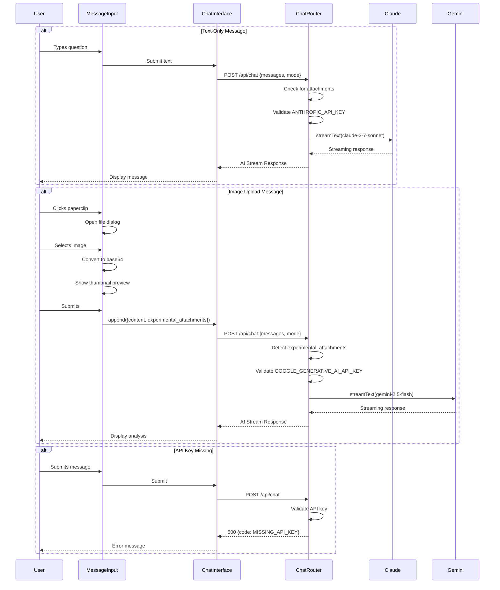

# Design Document: Multi-Model Polyglot Architecture

## Overview

This design implements a sophisticated multi-model AI architecture for ForgeFlight that intelligently routes requests between Claude 3.7 Sonnet (text-based tutoring) and Google Gemini 2.5 Flash (image analysis). The system maintains backward compatibility while adding powerful new capabilities: sectional chart analysis through image uploads and audio briefing playback.

The architecture follows a request-based routing pattern where the Chat Router analyzes incoming messages and selects the appropriate AI provider based on content type. This approach leverages each model's strengths: Claude's superior reasoning for Socratic tutoring and Gemini's multimodal capabilities for chart analysis.

Key design principles:
- Zero disruption to existing user experience
- Intelligent, transparent model selection
- Fail-safe error handling with clear user feedback
- Mobile-first responsive design
- Security-conscious API key management

## Architecture

### System Architecture Diagram

```mermaid
graph TB
    User[Student Pilot] --> UI[Chat Interface]
    UI --> QA[Quick Actions]
    UI --> MI[Message Input]
    UI --> ML[Message List]
    
    MI --> FileUpload[File Upload Handler]
    FileUpload --> Base64[Base64 Converter]
    
    QA --> AudioPlayer[Audio Player Component]
    
    UI --> ChatHook[useChat Hook]
    ChatHook --> API[/api/chat Route]
    
    API --> Router{Chat Router}
    Router --> |Check Message| AttachmentDetector[Attachment Detector]
    
    AttachmentDetector --> |Has Image| GeminiValidator[Gemini API Key Validator]
    AttachmentDetector --> |Text Only| ClaudeValidator[Claude API Key Validator]
    
    GeminiValidator --> |Valid| GeminiProvider[Gemini 2.5 Flash]
    ClaudeValidator --> |Valid| ClaudeProvider[Claude 3.7 Sonnet]
    
    GeminiValidator --> |Invalid| ErrorHandler[Error Handler]
    ClaudeValidator --> |Invalid| ErrorHandler
    
    GeminiProvider --> SystemPrompt[System Instruction + Mode Context]
    ClaudeProvider --> SystemPrompt
    
    SystemPrompt --> StreamResponse[Streaming Response]
    StreamResponse --> UI
    
    ErrorHandler --> ErrorResponse[Error Response]
    ErrorResponse --> UI
    
    style Router fill:#4a9eff
    style GeminiProvider fill:#34a853
    style ClaudeProvider fill:#8e44ad
    style ErrorHandler fill:#e74c3c
```

### Request Flow Sequence



## Components and Interfaces

### 1. Chat Router (app/api/chat/route.ts)

The Chat Router is the central intelligence of the multi-model system. It analyzes incoming requests and routes them to the appropriate AI provider.

**Responsibilities:**
- Parse incoming message payload
- Detect presence of image attachments
- Validate environment variables for selected provider
- Instantiate correct AI provider
- Apply system instructions with mode context
- Stream responses back to client
- Handle and log errors appropriately

**Key Logic:**

```typescript
// Pseudo-code for routing logic
function routeRequest(messages: Message[], mode?: StudyMode) {
  const lastMessage = messages[messages.length - 1];
  const hasAttachment = lastMessage.experimental_attachments?.length > 0;
  
  if (hasAttachment) {
    // Route to Gemini for image analysis
    validateApiKey('GOOGLE_GENERATIVE_AI_API_KEY');
    const google = createGoogleGenerativeAI({ apiKey });
    return streamText({
      model: google('gemini-2.5-flash'),
      system: buildSystemMessage(mode),
      messages: messages
    });
  } else {
    // Route to Claude for text-based tutoring
    validateApiKey('ANTHROPIC_API_KEY');
    const anthropic = createAnthropic({ apiKey });
    return streamText({
      model: anthropic('claude-3-7-sonnet-20250219'),
      system: buildSystemMessage(mode),
      messages: messages
    });
  }
}
```

**Error Handling Strategy:**
- Missing API keys return 500 with code `MISSING_API_KEY`
- Provider errors return 500 with code `AI_SERVICE_ERROR`
- All errors logged to console with context
- User-facing messages are sanitized (no sensitive data)

**Logging Strategy:**
```typescript
console.log(`📡 Routing to ${hasAttachment ? 'Gemini' : 'Claude'}`);
console.log(`🤖 Model: ${modelName}`);
console.error('🚨 ERROR:', sanitizedError);
```

### 2. Message Input Component (components/chat/message-input.tsx)

Enhanced to support image uploads while maintaining existing text input functionality.

**New State Management:**
```typescript
const [attachedImage, setAttachedImage] = useState<{
  file: File;
  preview: string;
} | null>(null);
```

**File Upload Flow:**
1. User clicks Paperclip icon
2. Hidden file input opens (accept="image/*")
3. User selects image file
4. FileReader converts to base64 data URL
5. Thumbnail preview displayed
6. On submit, append() called with experimental_attachments
7. File input cleared for reusability

**Base64 Conversion Implementation:**
```typescript
const handleFileSelect = async (file: File) => {
  const reader = new FileReader();
  reader.onloadend = () => {
    const base64String = reader.result as string;
    setAttachedImage({
      file: file,
      preview: base64String
    });
  };
  reader.readAsDataURL(file);
};
```

**Attachment Format:**
```typescript
experimental_attachments: [
  {
    name: file.name,
    contentType: file.type,
    url: base64DataUrl
  }
]
```

**Mobile Considerations:**
- Paperclip button: 48x48px touch target
- File input accepts camera on mobile devices
- Thumbnail preview: max 100px height, responsive width
- Input font-size: 16px (prevents iOS zoom)

### 3. Quick Actions Component (components/chat/quick-actions.tsx)

Enhanced to include functional audio player for pre-recorded briefings.

**New State:**
```typescript
const [showAudioPlayer, setShowAudioPlayer] = useState(false);
```

**Audio Player Integration:**
```typescript
{showAudioPlayer && (
  <div className="mt-3 p-3 bg-background-tertiary rounded-lg">
    <audio
      controls
      src="/audio/briefing.mp3"
      className="w-full"
      preload="metadata"
    >
      Your browser does not support audio playback.
    </audio>
  </div>
)}
```

**Button State Change:**
- Remove `disabled` attribute
- Add onClick handler: `() => setShowAudioPlayer(!showAudioPlayer)`
- Update styling to match active study mode buttons
- Add toggle behavior (show/hide player)

**Styling Requirements:**
- Dark mode compatible (inherit from parent)
- Full width on mobile
- Native browser controls (play, pause, seek, volume)
- Rounded corners matching app theme
- Subtle background to distinguish from chat area

### 4. System Instruction Enhancement (lib/ai/system-instruction.ts)

Enhanced with Socratic teaching methodology and knowledge verification requirements.

**New Sections to Add:**

```typescript
# Socratic Teaching Methodology

When a student asks a knowledge or conceptual question:
1. **Guide, don't tell**: Respond with questions that lead them to the answer
2. **Ask "What do you think would happen if..."**: Encourage hypothesis formation
3. **Celebrate correct reasoning**: When they reason correctly, acknowledge it enthusiastically before adding context
4. **Gently correct misconceptions**: If they're wrong, ask clarifying questions first: "Interesting thought. What about [related concept]?"
5. **Build on their knowledge**: Reference things they already know to scaffold new learning

Example:
Student: "Why do we lean the mixture at high altitude?"
Bad: "Because the air is less dense at altitude..."
Good: "Great question! Think about what happens to air density as you climb. What do you think that means for the fuel-to-air ratio?"

# Knowledge Base Verification

**CRITICAL VERIFICATION REQUIREMENTS**:
1. All V-speeds MUST come from the Elite Aviation Cessna 172-S data in this prompt
2. All procedures MUST match Elite Aviation's training methodology (CASA, CGUMPS, ABCD, etc.)
3. If asked about information NOT in the Elite Aviation knowledge base, you MUST:
   - Explicitly state: "This is outside our specific training materials, but generally..."
   - Recommend verification: "Please verify this with your instructor or the POH"
4. If uncertain about ANY specific value or procedure:
   - State clearly: "I'm not certain about this specific detail"
   - Direct to authoritative source: "Check section X of the POH" or "Ask your instructor"
5. NEVER guess or hallucinate aviation data - lives depend on accuracy

**Out-of-Scope Disclosure Template**:
"⚠️ Note: This information is outside our Elite Aviation training materials. While this is generally accurate aviation knowledge, please verify with your instructor or official documentation before relying on it for flight operations."
```

**Integration Points:**
- Existing SYSTEM_INSTRUCTION constant gets new sections appended
- STUDY_MODE_CONTEXTS remain unchanged
- No breaking changes to existing instruction structure

## Data Models

### Message with Attachment

```typescript
interface MessageWithAttachment {
  role: 'user' | 'assistant';
  content: string;
  experimental_attachments?: Array<{
    name: string;
    contentType: string;
    url: string; // base64 data URL
  }>;
}
```

### Chat Router Request

```typescript
interface ChatRouterRequest {
  messages: MessageWithAttachment[];
  mode?: StudyMode;
}
```

### Error Response

```typescript
interface ErrorResponse {
  error: string; // User-friendly message
  code: 'MISSING_API_KEY' | 'AI_SERVICE_ERROR';
  details?: string; // Technical details (dev only)
}
```

### Audio Player State

```typescript
interface AudioPlayerState {
  isVisible: boolean;
  isPlaying: boolean;
  currentTime: number;
  duration: number;
}
```

## Correctness Properties

*A property is a characteristic or behavior that should hold true across all valid executions of a system—essentially, a formal statement about what the system should do. Properties serve as the bridge between human-readable specifications and machine-verifiable correctness guarantees.*

### Property Reflection

After analyzing all acceptance criteria, I identified the following testable properties and performed redundancy elimination:

**Identified Properties:**
1. API key validation for text requests (1.3)
2. API key validation for image requests (1.4)
3. Model routing for messages with attachments (2.1)
4. Model routing for text-only messages (2.2)
5. Logging behavior for all requests (2.4)
6. Streaming response format consistency (2.5)
7. Base64 conversion correctness (5.4)
8. Attachment format compliance (5.5)
9. Error message sanitization (8.5)

**Redundancy Analysis:**
- Properties 1 and 2 (API key validation) can be combined into a single property about validation behavior across all request types
- Property 5 (logging) is an observability concern that doesn't affect correctness
- Properties 3 and 4 (routing) are complementary and should remain separate as they test different code paths

**Final Properties (after redundancy elimination):**

### Property 1: API Key Validation

*For any* request to the Chat Router, if the required API key for the selected provider is missing from environment variables, the system should return a 500 error response with code MISSING_API_KEY.

**Validates: Requirements 1.3, 1.4, 1.5**

### Property 2: Attachment-Based Routing to Gemini

*For any* message that contains one or more items in the experimental_attachments array, the Chat Router should select the Gemini provider with model gemini-2.5-flash.

**Validates: Requirements 2.1**

### Property 3: Text-Only Routing to Claude

*For any* message that has no experimental_attachments or an empty experimental_attachments array, the Chat Router should select the Claude provider with model claude-3-7-sonnet-20250219.

**Validates: Requirements 2.2**

### Property 4: Streaming Response Format Preservation

*For any* valid request (text-only or with attachments), the Chat Router should return a response in the AI SDK streaming format that is compatible with the useChat hook's consumption pattern.

**Validates: Requirements 2.5, 9.4**

### Property 5: Base64 Conversion Round-Trip

*For any* valid image file selected by the user, converting it to base64 and then decoding it should produce an image with identical content to the original.

**Validates: Requirements 5.4**

### Property 6: Attachment Format Compliance

*For any* image file uploaded through the Message Input, the resulting message payload should include an experimental_attachments array with objects containing name, contentType, and url fields matching the Vercel AI SDK specification.

**Validates: Requirements 5.5**

### Property 7: Error Message Sanitization

*For any* error response returned by the Chat Router, the error message should not contain sensitive information such as API keys, internal file paths, or stack traces.

**Validates: Requirements 8.5**

## Error Handling

### Error Categories

**1. Configuration Errors (500)**
- Missing API keys
- Invalid environment setup
- Response: User-friendly message + MISSING_API_KEY code
- Logging: Full error details to console

**2. Provider Errors (500)**
- AI service unavailable
- Rate limiting
- Invalid model parameters
- Response: Generic "try again" message + AI_SERVICE_ERROR code
- Logging: Full error with request context

**3. Client Errors (400)**
- Invalid message format
- Unsupported file type
- File too large (>10MB)
- Response: Specific validation error
- Logging: Warning level

**4. File Upload Errors (Client-Side)**
- File read failure
- Base64 conversion error
- Network interruption
- Response: Toast notification or inline error
- Logging: Console error with file metadata

### Error Recovery Strategies

**API Key Missing:**
```typescript
if (!apiKey) {
  console.error(`🚨 MISSING API KEY: ${keyName} not configured`);
  return new Response(
    JSON.stringify({ 
      error: 'AI service configuration error. Please contact support.',
      code: 'MISSING_API_KEY'
    }),
    { status: 500, headers: { 'Content-Type': 'application/json' } }
  );
}
```

**Provider Failure:**
```typescript
try {
  const result = await streamText({...});
  return result.toAIStreamResponse();
} catch (error) {
  console.error('🚨 PROVIDER ERROR:', error);
  return new Response(
    JSON.stringify({ 
      error: 'Unable to generate response. Please try again.',
      code: 'AI_SERVICE_ERROR'
    }),
    { status: 500, headers: { 'Content-Type': 'application/json' } }
  );
}
```

**File Upload Failure:**
```typescript
try {
  reader.readAsDataURL(file);
} catch (err) {
  console.error('File upload error:', err);
  setError('Failed to upload image. Please try again.');
}
```

### User-Facing Error Messages

All error messages follow these principles:
- Clear and actionable
- Non-technical language
- No sensitive data exposure
- Suggest next steps when possible

Examples:
- ✅ "Unable to connect to AI service. Please try again."
- ✅ "Failed to upload image. Please try again."
- ✅ "AI service configuration error. Please contact support."
- ❌ "ANTHROPIC_API_KEY is undefined"
- ❌ "Error: fetch failed at line 42"

## Testing Strategy

### Dual Testing Approach

This feature requires both unit tests and property-based tests to ensure comprehensive coverage. Unit tests verify specific examples and edge cases, while property tests verify universal behaviors across all inputs.

**Unit Testing Focus:**
- Specific error scenarios (missing API keys, invalid files)
- UI component rendering (buttons, audio player, thumbnails)
- Integration points (useChat hook, file input clearing)
- Edge cases (empty text with image, same file re-upload)

**Property Testing Focus:**
- Model routing logic across all message types
- Base64 conversion correctness for all valid images
- Error message sanitization for all error types
- Streaming response format consistency

### Property-Based Testing Configuration

**Library Selection:**
- **JavaScript/TypeScript**: fast-check (recommended for Next.js/React)
- Minimum 100 iterations per property test
- Each test tagged with feature name and property reference

**Tag Format:**
```typescript
// Feature: multi-model-polyglot-architecture, Property 2: Attachment-Based Routing to Gemini
```

### Test Coverage by Component

**Chat Router (app/api/chat/route.ts):**

Unit Tests:
- Missing ANTHROPIC_API_KEY returns 500 with MISSING_API_KEY code
- Missing GOOGLE_GENERATIVE_AI_API_KEY returns 500 with MISSING_API_KEY code
- Text-only message with valid key calls Claude provider
- Message with attachment and valid key calls Gemini provider
- Error responses don't expose API keys or stack traces
- System instruction includes mode context when mode is provided

Property Tests:
- Property 1: API Key Validation (100+ iterations with various missing key scenarios)
- Property 2: Attachment-Based Routing (100+ iterations with various attachment types)
- Property 3: Text-Only Routing (100+ iterations with various text messages)
- Property 4: Streaming Response Format (100+ iterations with both providers)
- Property 7: Error Message Sanitization (100+ iterations with various error types)

**Message Input (components/chat/message-input.tsx):**

Unit Tests:
- Paperclip button renders and is clickable
- File input opens when paperclip clicked
- File input accepts image/* types
- Thumbnail preview displays after file selection
- File input clears after successful upload
- Default text added when image attached without text
- Submit button disabled when no text and no image

Property Tests:
- Property 5: Base64 Conversion Round-Trip (100+ iterations with various image files)
- Property 6: Attachment Format Compliance (100+ iterations with various image types)

**Quick Actions (components/chat/quick-actions.tsx):**

Unit Tests:
- Audio Briefing button is not disabled
- Audio player hidden by default
- Audio player visible after button click
- Audio player has correct source (/audio/briefing.mp3)
- Audio player has controls attribute
- Button toggles player visibility on repeated clicks

**System Instruction (lib/ai/system-instruction.ts):**

Unit Tests:
- SYSTEM_INSTRUCTION includes Socratic method guidance
- SYSTEM_INSTRUCTION includes knowledge verification requirements
- SYSTEM_INSTRUCTION includes out-of-scope disclosure template
- All Elite Aviation V-speeds present and unchanged
- All Elite Aviation procedures present and unchanged

### Integration Testing

**End-to-End Scenarios:**
1. User sends text question → Claude responds with Socratic guidance
2. User uploads sectional chart → Gemini analyzes and explains
3. User clicks Audio Briefing → Player appears and plays audio
4. Missing API key → User sees friendly error message
5. Provider failure → User sees retry message, can send new message

**Mobile Testing:**
- Touch targets meet 48x48px minimum
- File upload works with camera on iOS/Android
- Audio player controls work on touch devices
- Thumbnail preview responsive on small screens
- No iOS zoom on input focus (16px font-size)

### Test Data

**Sample Messages:**
- Text-only: "What is Vx for the Cessna 172?"
- With attachment: {content: "What airspace is this?", experimental_attachments: [...]}
- Empty text with attachment: {content: "", experimental_attachments: [...]}
- Long text: 500+ character question

**Sample Images:**
- Sectional chart (PNG, 2MB)
- POH page (JPEG, 500KB)
- Whiteboard photo (HEIC on iOS)
- Large image (9MB, near limit)
- Invalid file (PDF, should be rejected)

**Error Scenarios:**
- ANTHROPIC_API_KEY missing
- GOOGLE_GENERATIVE_AI_API_KEY missing
- Both keys missing
- Invalid API key format
- Network timeout
- Provider rate limit exceeded

### Continuous Testing

**Pre-commit Hooks:**
- Run unit tests
- Run property tests (100 iterations)
- Lint TypeScript
- Type checking

**CI/CD Pipeline:**
- Full test suite on PR
- Property tests with 1000 iterations
- Build verification
- Deployment smoke tests

**Monitoring:**
- Log model selection for each request
- Track error rates by error code
- Monitor API key validation failures
- Alert on provider errors

